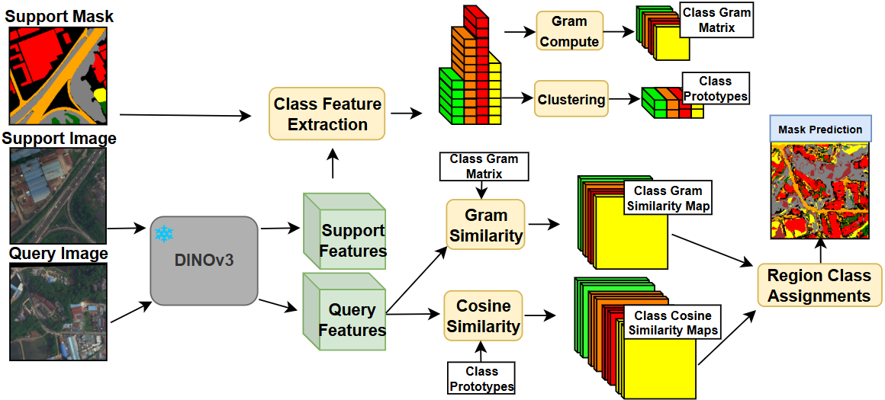

# FSSDINO: Official Repository



This is the official repository for **FSSDINO**.


## Getting Started

To begin, follow the setup instructions in **[setup.md](setup.md)**.

This includes:

* Setting up the datasets
* Verifying environment configuration
* Installing Python dependencies:

```bash
conda env create -f environment.yml
conda activate fssdino
```

Make sure all steps in `setup.md` and the commands above are completed before running any experiments.

---

## Configuration

After setup, you can configure which experiment to run by modifying the files in the `configs/` directory.

Before running an evaluation, ensure:

* All dataset paths point to the correct locations
* All checkpoint paths are correct
* `n_shot` and `k_way` match the experiment you want
* Optional flags are set as intended

### Key Configuration Fields

* **benchmark**: dataset benchmark to run
* **nshot**: Number of images per class in the support set
* **kway**: Number of classes in the support set

---

## Evaluation

Run the following commands to evaluate the method:

```bash
python fss_eval.py configs/deepglobe.yaml
python fss_eval.py configs/suim.yaml
python fss_eval.py configs/isic.yaml
python fss_eval.py configs/coco.yaml
python fss_oracle.py configs/deepglobe.yaml
python fss_oracle.py configs/suim.yaml
python fss_oracle.py configs/isic.yaml
python fss_oracle.py configs/coco.yaml
```

---

## Citation

If you find this work useful, please consider citing our method:

> Citation will be added soon.

---